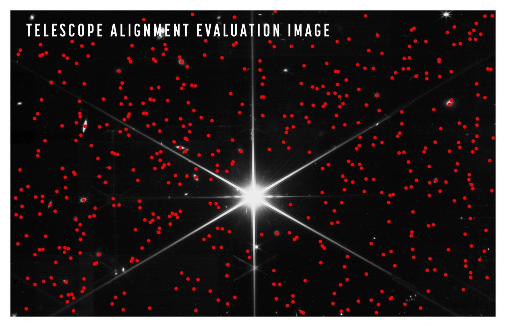
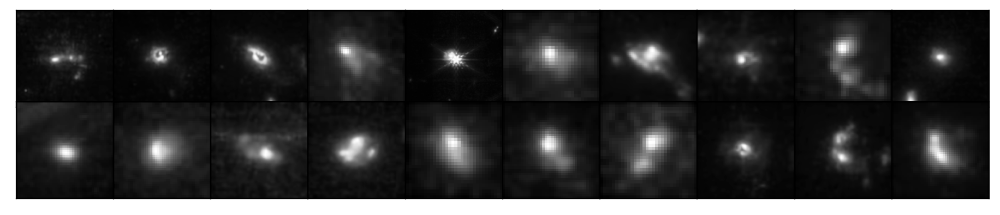
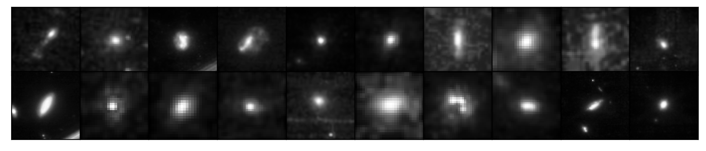

# JWST NASCAT (Not a Science Catalog)

The first ever JWST morphology catalog of ~490 sources from the Telescope Alignment Evaluation JPEG Image (https://www.nasa.gov/press-release/nasa-s-webb-reaches-alignment-milestone-optics-working-successfully). 

(use at your own risk)

JWST revealed tons of galaxies in the background of this 4x500s F200W image with enough resolution to resolve these sources beyond point source detection. Even with a lot of compression from the JPEG, we can still see shapes, structure and etc. If our eyes are capable of doing it, so does our computational machinery. 

After a couple of hours hiking hilly areas around Nottingham last Saturday, I thought this could be a wonderful form of productive procrastination. And what you have in this repository is the result of my body converting a thermos of Chimarrão into science (not really science btw).

## Reduction

I reduced the fits file produced by gbrammer (https://github.com/gbrammer/jwst_EERS), colapsed the RGB red colourmap into a greyscale image, masked the central star, estimated the background and detected the sources within it (everything was done with Photutils). From it, I generated stamps that were then fed to Morfometryka, which measures several structural and morphological parameters. A jupyter notebook with the main steps can be found in the body of the repository.

I ignored fluxes, mags and etc as the image is not in scientific format it most likely has truncated counts, renormalized to enhance faint structures and etc. 

## Catalog
Structure, non-parametric morphology and Sérsic profiles for ~490 sources in that JPEG.

The catalog is provided in a FITS table (NASCAT.fits) format and contains the following parameters:

> Basic info (for 490 sources) & Structure (for 437 sources)
  1. ID
  2. RA, DEC
  3. a - major-axis
  4. b - minor-axis
  5. q - axis ratio
  6. PAdeg - Position Angle in degrees
  7. Rp - Petrosian Radius
  8. SNB - Avg Signal per pixel to Background (not SNR)
> Sersic (407 sources)
  1. In, In_err - Effective Intensity and uncertainty
  2. Rn, Rn_err - Effective Radius and uncertainty
  3. n, n_err - Sérsic Index and uncertainty
> Morphology (394 sources)
  1. C28 - Concentration 28
  2. C59 - Concentration 59
  3. A, A_err - Asymmetry and Uncertainty
  4. S, S_err - Smoothness and Uncertainty
  5. G - Gini Index
  6. M20 - Second order moment of light for 20% of the brightest pixels
  7. H - Normalized Information Entropy

## Mergers?

## Disks?

## Troubleshooting

I'm not providing support for this...but if you happend to find a problem let me know ;) or use the issues tab.

# Acknowledgements
1. NASA/ESA and all teams involved in JWST.
2. gbrammer for providing the alignment so we can use WCS. (https://github.com/gbrammer/jwst_EERS)
2. Astropy & Photuils maintainers, developers and contributors for providing a very robust set of tools that can solve common tasks like the reduction here. 

